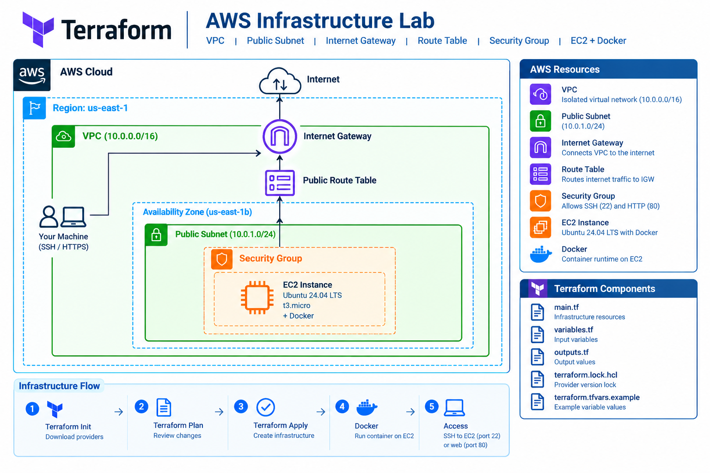
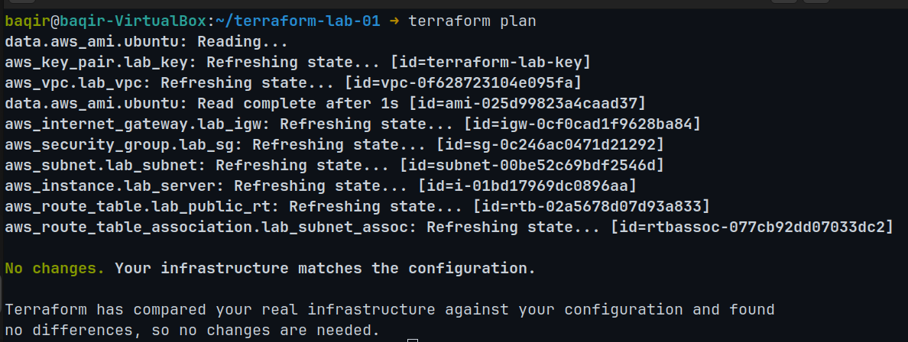
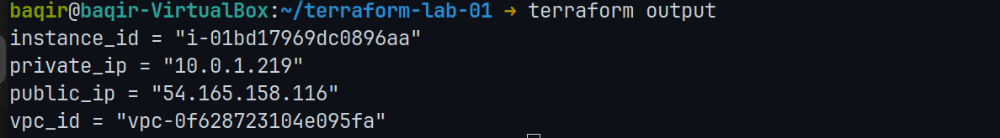
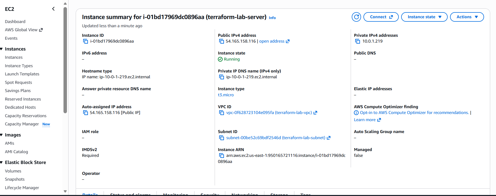
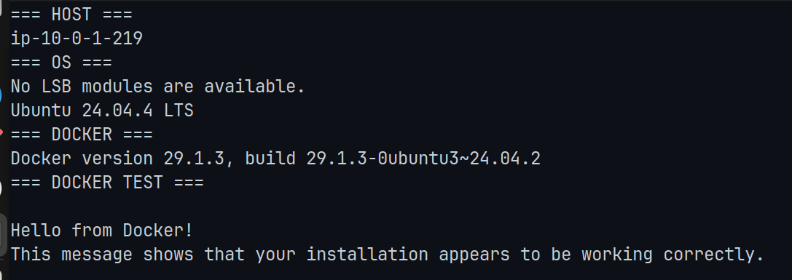

# Terraform AWS Infrastructure Lab

Hands-on Terraform project that provisions AWS networking, security, and an Ubuntu 24.04 EC2 server with Docker.

This project demonstrates practical Infrastructure as Code (IaC) using Terraform and AWS.

---

## Architecture

The infrastructure includes:

- AWS VPC
- Public subnet
- Internet Gateway
- Public route table
- Route table association
- Security Group
- AWS key pair
- Ubuntu 24.04 EC2 instance
- Docker installed on the EC2 instance

### Architecture Diagram

### Architecture Flow

    Internet
       |
       v
    Internet Gateway
       |
       v
    Public Route Table
       |
       v
    Public Subnet (10.0.1.0/24)
       |
       v
    Security Group
       |
       v
    Ubuntu EC2 (t3.micro)
       |
       v
    Docker

### AWS Network

    Region: us-east-1
    Availability Zone: us-east-1b

    VPC: 10.0.0.0/16
        |
        +-- Public Subnet: 10.0.1.0/24
                |
                +-- Internet Gateway
                |
                +-- Public Route Table
                |
                +-- Security Group
                |
                +-- EC2: Ubuntu 24.04 + Docker

---

## Terraform Resources

| Resource | Purpose |
|---|---|
| VPC | Isolated AWS network |
| Subnet | Public network segment |
| Internet Gateway | Internet connectivity |
| Route Table | Routes public traffic |
| Route Table Association | Associates subnet with public route table |
| Security Group | Controls inbound and outbound traffic |
| Key Pair | SSH authentication |
| EC2 Instance | Ubuntu server host |
| Docker | Container runtime on EC2 |

---

## Terraform Deployment

Terraform was used to define, validate, plan, and provision the AWS infrastructure.

### Terraform Plan

### Terraform Outputs

---

## AWS Infrastructure

### EC2 Instance

The Terraform configuration provisions an Ubuntu 24.04 EC2 instance in the public subnet.

The instance is configured with:

- Instance type: `t3.micro`
- Operating system: Ubuntu 24.04 LTS
- AWS Region: `us-east-1`
- Availability Zone: `us-east-1b`
- Public IP address
- Private IP address
- SSH access through a Security Group
- Docker installed on the server

---

## Server Verification

The provisioned EC2 server was accessed using SSH and Docker was verified by running the Docker `hello-world` container.

The verification confirms:

- SSH access to the EC2 instance
- Ubuntu 24.04 environment
- Docker installation
- Docker service functionality
- Successful container execution

---

## Prerequisites

Before deploying this project, install and configure:

- Ubuntu/Linux environment
- Terraform
- AWS CLI
- AWS account
- AWS credentials
- Existing SSH public key at `~/.ssh/id_ed25519.pub`

### Verify Terraform

    terraform version

### Verify AWS Authentication

    aws sts get-caller-identity

---

## Configuration

Create your local Terraform variables file:

    cp terraform.tfvars.example terraform.tfvars

Edit the file:

    nano terraform.tfvars

Example configuration:

    aws_region       = "us-east-1"
    instance_type    = "t3.micro"
    vpc_cidr         = "10.0.0.0/16"
    subnet_cidr      = "10.0.1.0/24"
    ssh_allowed_cidr = "YOUR_PUBLIC_IP/32"

The `terraform.tfvars` file is intentionally excluded from Git because it contains environment-specific configuration.

---

## Deploy

### Initialize Terraform

    terraform init

### Format the Configuration

    terraform fmt

### Validate the Configuration

    terraform validate

### Review the Execution Plan

    terraform plan

### Apply the Infrastructure

    terraform apply

Review the proposed changes and confirm with `yes`.

---

## View Outputs

Display all Terraform outputs:

    terraform output

Get the EC2 public IP:

    terraform output -raw public_ip

SSH into the server:

    ssh ubuntu@$(terraform output -raw public_ip)

---

## Verify Docker

After connecting to the EC2 instance:

    docker --version

Test Docker:

    docker run hello-world

A successful `hello-world` execution confirms that Docker is installed and able to run containers.

---

## Security

The EC2 Security Group controls access to the server.

SSH access is restricted to the configured public IP address using a `/32` CIDR.

Example:

    ssh_allowed_cidr = "YOUR_PUBLIC_IP/32"

This limits SSH access rather than exposing port 22 to the entire internet.

The project does not commit:

- AWS credentials
- Terraform state
- `terraform.tfvars`
- SSH private keys
- `.terraform/` working directory

---

## Terraform State and Git

Terraform state and local environment-specific files are excluded using `.gitignore`.

The following files should not be committed:

    .terraform/
    terraform.tfstate
    terraform.tfstate.backup
    terraform.tfvars

The Terraform provider lock file is intentionally committed:

    .terraform.lock.hcl

This helps maintain consistent provider versions across environments.

---

## Project Structure

    terraform-lab-01/
    ├── .gitignore
    ├── .terraform.lock.hcl
    ├── main.tf
    ├── variables.tf
    ├── terraform.tfvars.example
    ├── README.md
    └── docs/
        └── images/
            ├── 01-architecture.png
            ├── 02-terraform-plan.png
            ├── 04-terraform-outputs.png
            ├── 05-aws-ec2.png
            └── 06-ssh-docker.png

---

## Screenshots

### Architecture

### Terraform Plan

### Terraform Outputs

### AWS EC2

### SSH and Docker

---

## Learning Objectives

This project demonstrates practical Terraform and AWS concepts including:

- Infrastructure as Code
- Terraform providers
- Terraform variables
- Terraform outputs
- Terraform data sources
- Terraform state management
- Terraform lifecycle behavior
- AWS VPC
- AWS subnet configuration
- Internet Gateway
- Route tables
- Security Groups
- EC2 provisioning
- SSH access
- Ubuntu server administration
- Cloud-init and user data
- Docker installation
- Docker container execution
- Git version control
- GitHub project management

---

## Future Improvements

Possible extensions for this project include:

- Terraform variable validation
- Separate Terraform files for networking, security, and compute
- Multiple availability zones
- Private subnet architecture
- NAT Gateway
- Application Load Balancer
- Remote Terraform state using Amazon S3
- State locking
- Terraform modules
- CI/CD validation with GitHub Actions
- Automated security scanning
- Dockerized application deployment

---

## Cleanup

When the lab is complete, destroy the infrastructure to avoid unnecessary AWS charges:

    terraform destroy

Review the resources that will be removed and confirm with `yes`.

This removes the AWS infrastructure managed by this Terraform configuration.
